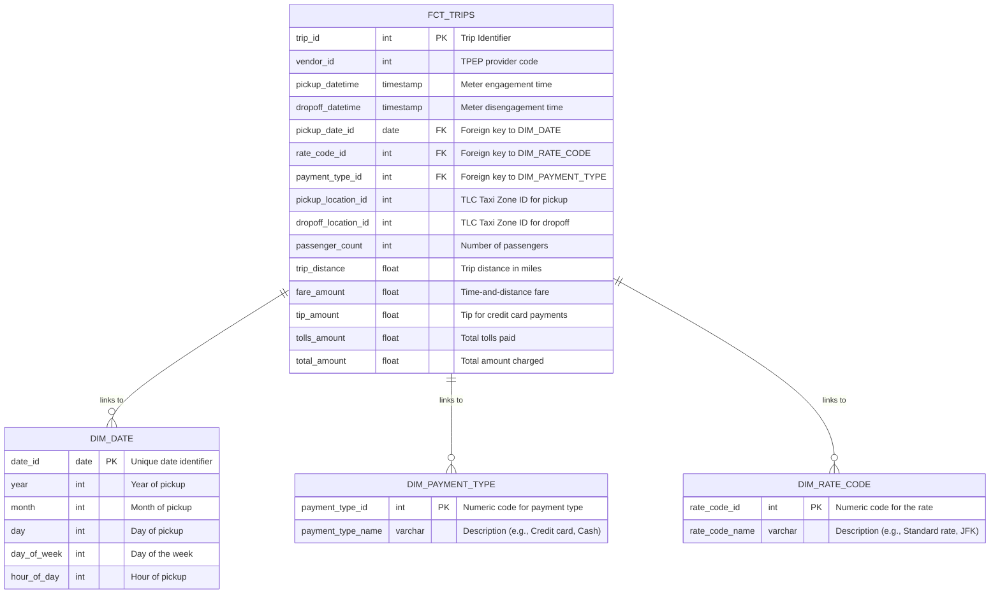

# Snowflake ELT Pipeline for NYC Taxi Data Analysis 🚕

This project demonstrates a complete and robust ELT (Extract, Load, Transform) pipeline built on **Snowflake**, ingesting data from **AWS S3**. It transforms raw NYC taxi trip data into a clean, analytics-ready **star schema** to enable efficient business intelligence and data analysis.

---
## 🏛️ Project Architecture

The pipeline follows a modern, multi-layered data architecture, ensuring a clear separation between raw and transformed data. This approach enhances scalability, data integrity, and re-processability.

1.  **External Data Stage (S3):** Raw CSV data is stored and managed in an AWS S3 bucket. A secure connection is established using a Snowflake **Storage Integration**, which allows Snowflake to read from the bucket without exposing credentials.
2.  **Staging Layer (Load):** A manual `COPY` command ingests the data from S3 into a raw staging table (`STG_TRIPS`) within a dedicated `RAW` schema. This table is a direct, unfiltered copy of the source data.
3.  **Analytics Layer (Transform):** A SQL script runs within Snowflake to clean, model, and transform the raw data into a dimensional model (star schema) in a separate `ANALYTICS` schema. This creates the final, business-ready tables.

---
## ⭐ Data Model: The Star Schema

The core of this project is a **dimensional model** (star schema), which is the industry standard for building fast and intuitive data warehouses for analytics. It consists of a central fact table containing quantitative measurements, surrounded by descriptive dimension tables that provide context.

### Schema Visualization

The diagram below illustrates the relationships between the fact and dimension tables, including their primary keys (PK) and foreign keys (FK).

---

* **`FCT_TRIPS` (Fact Table):** This central table contains the measurements for each taxi trip event, such as the fare, tip, and distance amounts.
* **`DIM_DATE` (Dimension Table):** Provides temporal context, breaking down the pickup timestamp for time-based analysis.
* [cite_start]**`DIM_PAYMENT_TYPE` (Dimension Table):** Describes how the passenger paid for the trip (e.g., 'Credit card', 'Cash'). [cite: 5]
* [cite_start]**`DIM_RATE_CODE` (Dimension Table):** Describes the fare type for the trip (e.g., 'Standard rate', 'JFK' for airport flat fares). [cite: 5]

---
## 💾 Dataset Used

This project utilizes the **NYC Yellow Taxi Trip Data**, which is publicly available on Kaggle. It contains detailed, anonymized trip records from New York City's iconic yellow taxis.

* **Source:** [NYC Taxi Trip Data on Kaggle](https://www.kaggle.com/datasets/anandaramg/taxi-trip-data-nyc/data)

---
## ✨ Key Features

* **Separation of Concerns:** Using distinct `RAW` and `ANALYTICS` schemas protects the source data and makes the transformation logic modular and repeatable.
* **Scalability:** Built on Snowflake's cloud architecture, this pipeline can effortlessly scale to handle billions of rows without performance degradation.
* **Industry Best Practices:** Employs dimensional modeling (star schema) for an analytics-optimized data structure.
* **Secure Cloud Integration:** Uses Snowflake's recommended Storage Integration for secure, password-less access to AWS S3.

---
## 🚀 How to Run This Project

Follow these steps to set up and run the pipeline:

1.  **Configure Cloud & Snowflake:**
    * Set up the required **IAM Policy and Role** in your AWS account.
    * Execute the first part of `sql/01_setup.sql` in Snowflake to create the **Storage Integration**.
    * Update the AWS IAM Role's **Trust Relationship** with the details from Snowflake. This is a one-time secure setup.
2.  **Deploy Snowflake Objects:**
    * Run the rest of the `sql/01_setup.sql` script to create the database, schemas, warehouse, stage, and staging table.
3.  **Upload & Ingest Data:**
    * Download the dataset from Kaggle and upload the `taxi_tripdata.csv` file to your S3 bucket.
    * Execute the `sql/02_ingestion.sql` script to run the `COPY` command, loading the data into the `STG_TRIPS` table.
4.  **Transform Data:**
    * Run the `sql/03_transformation.sql` script. This is the core logic that builds the final star schema in the `ANALYTICS` schema.
5.  **Derive Insights:**
    * Execute the queries in `sql/04_analysis_queries.sql` to see examples of how the model can answer business questions about payment trends, peak travel hours, and more.

---
## 📊 Sample Analytical Queries

The final step is to leverage the model. The queries in `04_analysis_queries.sql` demonstrate how to join the fact and dimension tables to uncover insights such as:

* What is the average fare and total revenue by payment type?
* What are the busiest hours of the day for taxi pickups?
* How does trip distance and revenue vary by special rate codes (e.g., airport trips)?
